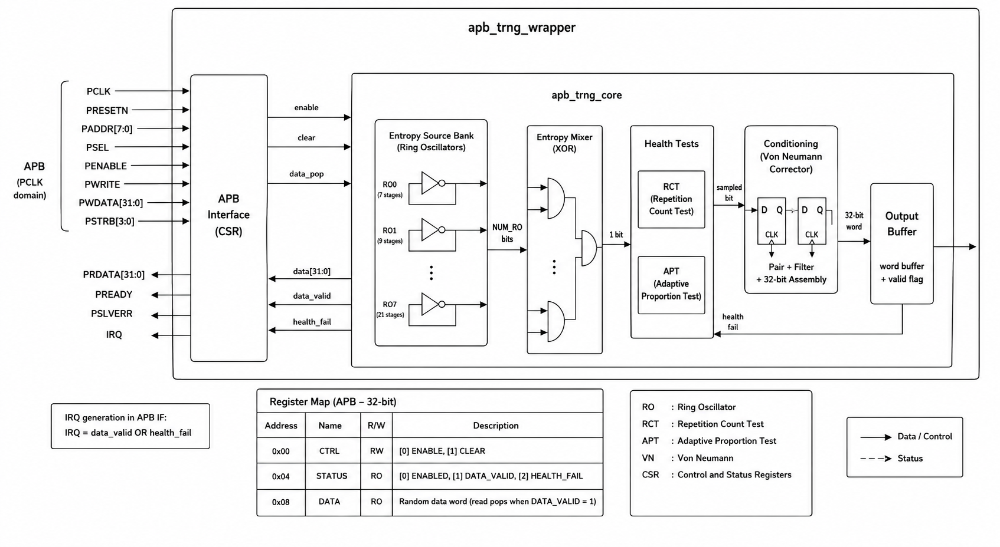

# Compact APB TRNG Core for GF180MCU

This repository contains a small APB true-random-number generator built around
eight ring oscillators. The hardware path is intentionally limited to the
blocks needed to produce and expose one 32-bit random word.

## Architecture



```text
8 ring oscillators
        |
     XOR tree
        |
2-flop synchronizer
        |
minimal RCT + APT health tests
        |
Von Neumann debiaser
        |
32-bit collector
        |
APB DATA / STATUS / CTRL
```

When `GF180MCU_SC` is defined, the oscillator and XOR paths instantiate the
GF180 MCU 9-track NAND2, inverter, and XOR2 cells explicitly. The normal RTL
build uses deterministic LFSR surrogates so compile and static checks do not
attempt to simulate a zero-delay combinational ring.

The online tests use fixed, minimal defaults:

- RCT cutoff: 32 identical consecutive samples.
- APT window: 64 samples, accepted population from 16 through 48.
- A health failure is sticky until software issues `CLEAR`.
- A completed random word remains valid until APB reads `DATA`.

## APB Register Map

| Address | Register | Description |
|---:|---|---|
| `0x00` | `CTRL` | Bit 0 `ENABLE`; bit 1 write-one pulse `CLEAR` |
| `0x04` | `STATUS` | Bit 0 enabled; bit 1 data valid; bit 2 health fail |
| `0x08` | `DATA` | 32-bit random word; a valid read consumes the word |

`IRQ` is asserted while either `DATA_VALID` or `HEALTH_FAIL` is set.

## File Lists

- `filelist.f`: technology-independent RTL compile list.
- `filelist_gf180.f`: GF180 functional cell models only.

## Synopsys Checks

```sh
make compile          # VCS compile of technology-independent RTL
make compile-gf180    # VCS elaboration with GF180 cells
make lint             # SpyGlass lint
make cdc              # SpyGlass CDC
make rdc              # SpyGlass RDC
make check            # compile + lint + CDC + RDC
make clean            # remove tool work data, preserve reports/*.log and summaries
```

Reports and compact summaries are written to `reports/`. Project and constraint
files are kept in `lint/`, `cdc/`, and `rdc/`.

> RTL simulation and online health tests do not certify entropy quality.
> Silicon characterization across PVT corners is required before tapeout.
