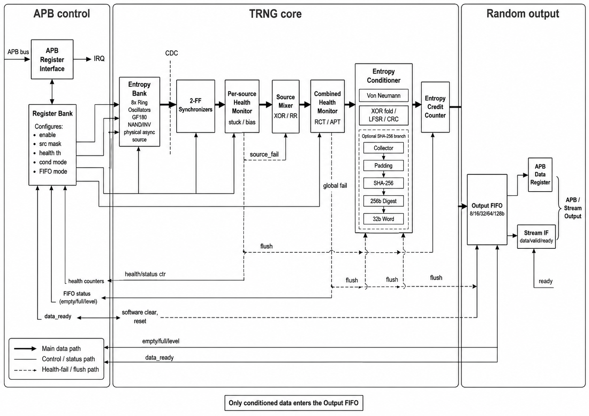

# APB TRNG Core for GF180MCU

[](https://github.com/briann-bui/apb-trng-core/actions/workflows/lint.yml)

An APB True Random Number Generator using multiple GF180 ring oscillators as
physical entropy sources, with online health tests, entropy conditioning, and
an output FIFO.

## Features

- Eight independently controlled ring oscillators with different lengths.
- Explicit GF180 NAND, inverter, and XOR cells when `GF180MCU_SC` is defined.
- Two-flop RO synchronization, stuck detection, RCT, APT, and auto-quarantine.
- Von Neumann debiasing with XOR, LFSR, CRC, or SHA-256 conditioning.
- Configurable 2x, 4x, or 8x accepted-bit entropy budget per output word.
- Configurable 8/16/32/64/128-bit output and 4-64-entry FIFO.
- APB register interface, ready/valid stream, backpressure, and interrupts.
- UVM 1.2 environment and SHA-256 known-answer tests.

## Architecture



## Build and Verification

```sh
make lint          # Technology-independent RTL lint
make lint-gf180    # GF180 cell variant lint
make sim           # Module-level TRNG regression
make sim-sha       # SHA-256 known-answer tests
make run           # Class-based UVM regression
make all           # Run the complete regression
```

Run an individual UVM test:

```sh
make run UVM_TEST=apb_trng_reg_test
make run UVM_TEST=apb_trng_entropy_test
make run UVM_TEST=apb_trng_health_test
```

## Repository Structure

```text
rtl/          TRNG RTL and SHA-256 core
uvm/          UVM environment and testbenches
docs/         Architecture diagram
```

> RTL simulation does not certify entropy quality. Silicon characterization
> across PVT corners and entropy-source assessment are required before tapeout.

