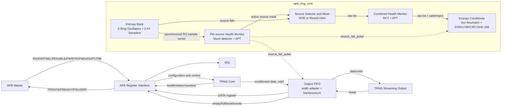

# Kiến trúc APB TRNG Core

Tài liệu này mô tả cấu trúc phần cứng của IP `apb-trng-core` để phục vụ việc
đọc RTL, tích hợp SoC và vẽ block diagram. Phiên bản RTL được mô tả là
`0x0005_0001`.

> IP dùng ring-oscillator jitter làm nguồn entropy vật lý. Kết quả mô phỏng RTL
> chỉ xác nhận logic số, không chứng nhận chất lượng entropy trên silicon.

## 1. Chức năng tổng quát

IP tạo random data theo chuỗi xử lý sau:

1. Tám ring oscillator GF180 chạy song song tạo các tín hiệu bất đồng bộ.
2. Mỗi tín hiệu RO đi qua bộ đồng bộ hai flip-flop vào miền `PCLK`.
3. Health monitor kiểm tra từng source, loại source bị stuck hoặc bias.
4. Các source còn hoạt động được kết hợp bằng XOR hoặc chọn round-robin.
5. Combined health monitor chạy RCT và APT trên raw bit stream.
6. Von Neumann corrector có thể loại bias và loại các cặp raw bit không hợp lệ.
7. Conditioner dùng XOR fold, LFSR, CRC hoặc SHA-256.
8. Chỉ khi tích lũy đủ entropy credit, một random word 32-bit mới được công bố.
9. Output FIFO cung cấp dữ liệu qua APB register hoặc ready/valid stream.

## 2. Block diagram cấp cao

Sơ đồ dưới đây bám theo hierarchy RTL hiện tại:



Khi vẽ bằng công cụ đồ họa, có thể chia trang thành ba vùng:

- Bên trái: APB interface và configuration registers.
- Chính giữa: entropy generation, health monitoring và conditioning pipeline.
- Bên phải: output FIFO, APB data register và streaming interface.

Đường data nên vẽ nét liền từ trái sang phải. Đường configuration/status nên
vẽ nét mảnh hoặc màu xanh. Đường health-fail/flush nên vẽ nét đứt màu đỏ.

## 3. Hierarchy RTL

```text
apb_trng_wrapper
├── apb_trng_apb_if
├── apb_trng_core
│   ├── apb_trng_entropy_bank
│   │   └── apb_trng_ro × NUM_RO
│   ├── apb_trng_entropy_mixer
│   └── apb_trng_conditioner
│       └── apb_trng_sha256_adapter
│           └── apb_trng_sha256_core
│               ├── apb_trng_sha256_ctrl
│               └── apb_trng_sha256_datapath
│                   ├── apb_trng_sha256_msg_schedule
│                   ├── apb_trng_sha256_constants
│                   └── apb_trng_sha256_round
└── apb_trng_output_fifo
```

## 4. Vai trò của từng block

| Block RTL | Vai trò chính | Dữ liệu vào | Dữ liệu ra |
| --- | --- | --- | --- |
| `apb_trng_wrapper` | Top-level, nối control/data/status giữa các block | APB, stream ready, clock/reset | APB response, IRQ, random stream |
| `apb_trng_apb_if` | Register bank và APB protocol | APB request, core/FIFO status | Configuration, APB read data, IRQ |
| `apb_trng_entropy_bank` | Tạo và đồng bộ nhiều entropy source | Enable mask, clock/reset | Vector RO sample đã đồng bộ |
| `apb_trng_ro` | Một ring oscillator vật lý hoặc RTL surrogate | Source enable | Một RO bit bất đồng bộ |
| `apb_trng_entropy_mixer` | XOR các source active bằng GF180 XOR cells | Sample vector, active mask | XOR mixed bit |
| `apb_trng_core` | Source selection, health tests, quarantine và raw control | Configuration, sampled RO bits | Conditioned word, health/status |
| `apb_trng_conditioner` | Debias, whitening, entropy credit và SHA control | Raw bit/valid/reject | Conditioned 32-bit word |
| `apb_trng_sha256_adapter` | Đóng gói message và padding thành SHA block | 64/128/256 accepted bits | Digest word `[255:224]` |
| `apb_trng_sha256_core` | Thực hiện SHA-256 64 rounds | 512-bit padded block | 256-bit digest |
| `apb_trng_output_fifo` | Pack/split width, lưu hàng đợi và backpressure | Conditioned 32-bit words | APB data hoặc stream data |

## 5. Entropy source và GF180 cells

Mặc định `NUM_RO=8`, `BASE_STAGES=7`. Số stage của các ring là:

```text
RO0 = 7 stages
RO1 = 9 stages
RO2 = 11 stages
RO3 = 13 stages
RO4 = 15 stages
RO5 = 17 stages
RO6 = 19 stages
RO7 = 21 stages
```

Một RO vật lý gồm:

```text
                      ┌───────────────────────────────┐
                      │                               │
enable ──► NAND2 ──► INV ──► INV ──► ... ──► INV ──┘
            │                                  │
            └── disable/enable gate            └── RO output
```

Khi define `GF180MCU_SC`:

- Enable gate dùng `gf180mcu_fd_sc_mcu9t5v0__nand2_1`.
- Delay stages dùng `gf180mcu_fd_sc_mcu9t5v0__inv_1`.
- XOR entropy mixer dùng `gf180mcu_fd_sc_mcu9t5v0__xor2_1`.
- Các cell nhạy vật lý có thuộc tính `keep` và `dont_touch`.

Nếu không define `GF180MCU_SC`, `apb_trng_ro` dùng LFSR deterministic để test
logic. LFSR này không phải nguồn entropy và không được dùng trong netlist
tapeout.

RO output là asynchronous đối với `PCLK`. `apb_trng_entropy_bank` dùng hai
flip-flop nối tiếp:

```text
RO asynchronous output ──► sync_ff1 ──► sync_ff2 ──► sampled source bit
                              ▲
                         metastability boundary
```

## 6. Source management và health monitoring

### 6.1 Active source mask

```text
source_active = source_enable AND
                (auto_quarantine ? NOT source_fail : all_ones)
```

`SOURCE_EN` cho phép phần mềm bật/tắt từng RO. `SOURCE_FAIL` là sticky mask.
Khi auto-quarantine bật, source đã fail bị loại khỏi mixer nhưng các source khỏe
vẫn tiếp tục hoạt động.

### 6.2 Per-source tests

Mỗi source có:

- Stuck detector: đếm số sample liên tiếp không đổi.
- Adaptive Proportion Test: đếm số bit `1` trong cửa sổ 64 sample.

Source fail nếu stuck count vượt `STUCK_LIMIT`, hoặc số bit `1` nằm ngoài
`PROP_LOW..PROP_HIGH`.

### 6.3 Source combination

`SOURCE_CFG[0]` chọn một trong hai mode:

- `0`: XOR tất cả source active.
- `1`: Round-robin, mỗi sample tick chọn một source active.

XOR là normal operating mode. Round-robin hữu ích khi bring-up hoặc đánh giá
từng source.

### 6.4 Combined tests

Sau source mixer, raw stream chạy qua:

- Repetition Count Test: phát hiện chuỗi bit giống nhau quá dài.
- Adaptive Proportion Test: kiểm tra tỷ lệ bit `1` trên cửa sổ 64 sample.

Raw event chỉ có `valid=1` khi không có combined failure và không có source mới
fail tại sample tick đó.

### 6.5 Fail-safe flush path

Khi một source mới fail:

```text
source_fail_now
      │
      ├──► sticky SOURCE_FAIL bit
      ├──► remove source from active mask
      └──► source_fail_pulse
                 ├──► clear partial conditioner message/credit
                 └──► flush every queued FIFO word
```

Flush diễn ra trên cùng cạnh clock chốt quarantine bit. Vì vậy dữ liệu từng bị
ảnh hưởng bởi source lỗi không được giữ lại để đọc sau đó.

## 7. Entropy conditioning

Conditioner nhận ba tín hiệu chính:

- `raw_bit`: giá trị raw entropy.
- `raw_valid`: raw bit được phép sử dụng.
- `raw_reject`: event bị health logic loại bỏ.

### 7.1 Von Neumann corrector

Khi `VN_ENABLE=1`, raw bits được xử lý theo cặp:

| Raw pair | Kết quả |
| --- | --- |
| `01` | Emit `0` |
| `10` | Emit `1` |
| `00` | Reject |
| `11` | Reject |

`REJECT_CNT` đếm các pair bị loại và raw health event không hợp lệ.

### 7.2 Conditioning modes

| `COND_CFG[1:0]` | Mode | Chức năng |
| --- | --- | --- |
| `00` | XOR fold | XOR accepted bits vào 32 accumulator lanes |
| `01` | LFSR | Whitening bằng polynomial `0x00400007` |
| `10` | CRC | Conditioning bằng polynomial `0x04C11DB7` |
| `11` | SHA-256 | Hash message 64/128/256-bit và xuất 32 digest bits |

### 7.3 Entropy credit

Mỗi accepted bit tăng credit. Một output 32-bit chỉ được phát khi đủ:

| `COND_CFG[5:4]` | Tỷ lệ | Accepted bits/output word |
| --- | --- | --- |
| `00` | 2x | 64 |
| `01` | 4x | 128 |
| `10`, `11` | 8x | 256 |

Việc đổi mode, đổi oversampling, clear, global health failure hoặc source mới
fail đều làm mất toàn bộ partial credit.

## 8. SHA-256 conditioning path

SHA mode có thể được vẽ thành sub-block riêng bên trong conditioner:


`r_sha_start` là pulse một chu kỳ. Sau mỗi digest, conditioner phải thu một
message entropy hoàn toàn mới trước khi start SHA lần tiếp theo. SHA core không
tự tạo thêm output khi chưa có entropy mới.

## 9. Output FIFO và interface

Conditioner luôn tạo block cơ sở 32-bit. `apb_trng_output_fifo` chuyển đổi theo
parameter `OUTPUT_WIDTH`:

- `8` hoặc `16`: split một conditioned word thành nhiều FIFO entries.
- `32`: ghi trực tiếp một word.
- `64` hoặc `128`: pack nhiều conditioned words thành một FIFO entry.

`FIFO_DEPTH` hỗ trợ từ 4 đến 64 entries.

### 9.1 APB output mode

- Non-blocking: đọc FIFO rỗng trả `0`, set `data_not_ready`.
- Blocking: đọc `DATA` khi FIFO rỗng giữ `PREADY=0` đến khi có dữ liệu.
- Mỗi successful DATA read tiêu thụ dữ liệu mới.
- Với output lớn hơn 32-bit, phần mềm đọc nhiều slice 32-bit liên tiếp.

### 9.2 Streaming output mode

```text
o_trng_stream_data  : random output word
o_trng_stream_valid : FIFO contains valid data
i_trng_stream_ready : downstream accepts data
```

FIFO chỉ pop khi `VALID && READY`. Khi `READY=0`, data và valid được giữ ổn
định. Khi FIFO full, ready quay về conditioner bị hạ để tạo backpressure.

## 10. APB control và status path

`apb_trng_apb_if` nằm song song với entropy data path. Nó không tạo entropy;
nó chỉ cấu hình các block và phản hồi trạng thái.

Các nhóm register nên thể hiện trên block diagram như sau:

| Nhóm | Register | Block nhận/cung cấp thông tin |
| --- | --- | --- |
| Global control | `CTRL`, `VERSION` | Wrapper/core |
| Sampling | `SAMPLE_DIV`, `RO_SAMPLE` | Entropy bank/core |
| Source control | `SOURCE_EN`, `SOURCE_CFG`, `SOURCE_ACTIVE` | Source manager |
| Health | `HEALTH_CFG`, `STUCK_LIMIT`, `SOURCE_FAIL`, `HEALTH_CNT` | Health monitors |
| Conditioning | `COND_CFG`, `ENTROPY_CNT`, `REJECT_CNT` | Conditioner |
| Output | `DATA`, `OUTPUT_CFG`, `FIFO_LEVEL`, `OUTPUT_INFO` | Output FIFO |
| Interrupt | `IRQ_EN`, `IRQ_STAT` | APB interface |

IRQ có hai nguyên nhân:

- Bit 0: random word mới vào FIFO.
- Bit 1: health failure event.

## 11. Clock, reset và clear

Toàn bộ logic số dùng `i_trng_pclk`. Chỉ các RO output tồn tại ngoài miền
clock này và phải đi qua synchronizer.

`i_trng_presetn` là active-low asynchronous reset. Sau reset:

- TRNG bị disable.
- FIFO rỗng và output valid bằng 0.
- Conditioner không giữ entropy credit.
- Health/source fail state được xóa.
- RO không được bật cho đến khi phần mềm set `CTRL[0]`.

Các sự kiện làm flush output/partial entropy:

- Global reset.
- Software clear qua `CTRL[1]`.
- Conditioning policy thay đổi.
- Global health failure.
- Một source mới bị quarantine.

## 12. Top-level interface

### APB signals

| Signal | Hướng | Mô tả |
| --- | --- | --- |
| `i_trng_pclk` | Input | APB và core clock |
| `i_trng_presetn` | Input | Active-low reset |
| `i_trng_paddr` | Input | APB address |
| `i_trng_psel` | Input | APB peripheral select |
| `i_trng_penable` | Input | APB access phase |
| `i_trng_pwrite` | Input | Read/write direction |
| `i_trng_pwdata` | Input | APB write data |
| `i_trng_pstrb` | Input | APB byte strobes |
| `o_trng_prdata` | Output | APB read data |
| `o_trng_pready` | Output | APB ready/backpressure |
| `o_trng_pslverr` | Output | APB error, hiện cố định bằng 0 |
| `o_trng_irq` | Output | Data-ready hoặc health-fail interrupt |

### Streaming signals

| Signal | Hướng | Mô tả |
| --- | --- | --- |
| `o_trng_stream_data` | Output | Conditioned random word |
| `o_trng_stream_valid` | Output | Output word valid |
| `i_trng_stream_ready` | Input | Consumer ready |

## 13. Parameters

| Parameter | Mặc định | Ý nghĩa |
| --- | --- | --- |
| `C_APB_DATA_WIDTH` | 32 | APB data width, implementation hiện yêu cầu 32 |
| `C_APB_ADDR_WIDTH` | 8 | APB address width |
| `NUM_RO` | 8 | Số ring oscillators |
| `BASE_STAGES` | 7 | Số stage của RO đầu tiên |
| `OUTPUT_WIDTH` | 32 | Random output width: 8/16/32/64/128 |
| `FIFO_DEPTH` | 8 | Output FIFO entries: 4..64 |

## 14. Gợi ý block diagram dùng cho tài liệu/tapeout review

Một block diagram đầy đủ nên thể hiện tối thiểu:

1. Tám RO riêng biệt và stage count khác nhau.
2. CDC boundary tại hai sampling flip-flop.
3. Per-source health monitor và quarantine mask.
4. XOR/round-robin selector.
5. Combined RCT/APT monitor.
6. Von Neumann block.
7. Conditioning mode mux với SHA-256 sub-block.
8. Entropy-credit counter trước output-valid.
9. Output FIFO cùng APB/stream mux.
10. APB register bank chạy song song với data path.
11. Health-fail/flush path quay về conditioner và FIFO.

Không nên vẽ RO như một logic block synchronous thông thường. Hãy đánh dấu RO
là vùng asynchronous/physical entropy và đặt đường ranh CDC ngay trước
`sync_ff1`.

## 15. Giới hạn trước khi tapeout

Block diagram chức năng không thay thế physical sign-off. Trước tapeout cần:

- Giữ nguyên toàn bộ NAND/INV ring sau synthesis.
- Floorplan từng ring compact nhưng tách các ring khỏi nhau.
- Kiểm tra CDC, reset release và metastability MTBF.
- Chạy STA cho logic synchronous và không timing RO như clock chức năng.
- Có DFT/scan policy cưỡng bức tắt RO.
- Chạy DRC, LVS, antenna, IR-drop và EM.
- Thu raw samples trên silicon qua nhiều PVT corners.
- Đánh giá entropy source theo quy trình phù hợp như SP 800-90B.

## 16. UVM verification environment

IP có class-based UVM 1.2 environment thật trong `uvm/`:

```text
apb_trng_tb_top
└── apb_trng_all_test
    └── apb_trng_env
        ├── apb_trng_agent
        │   ├── apb_trng_apb_sequencer
        │   ├── apb_trng_apb_driver
        │   └── apb_trng_apb_monitor
        └── apb_trng_scoreboard
```

Các sequence chính:

- `apb_trng_reg_seq`: reset defaults, version, output information và register
  read/write.
- `apb_trng_entropy_seq`: conditioned output, ba SHA words liên tiếp và fresh
  entropy requirement.
- `apb_trng_health_seq`: stuck detection, quarantine, FIFO flush và entropy
  credit flush.

Chạy toàn bộ bằng `make run`; chọn test riêng bằng
`make run UVM_TEST=<test_name>`. Hai module-level regression cũ vẫn được giữ
trong `uvm/tb/` và chạy bằng `make sim`, `make sim-sha`.
